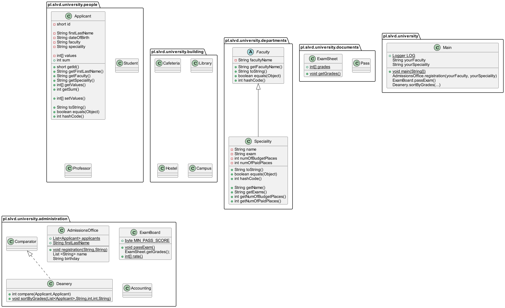

**University**\
My project "University" describes the process of admission by an Applicant to the University and answers the questions:
- What faculties and specialties are there at the University
- What specialty to choose
- Which faculty will the chosen specialty belong to?
- What exams does the Applicant need to pass in order to enroll in the chosen specialty?
- How to apply to the University
- How to pass exams
- What is the passing score for each exam
- What is the number of budget and paid places in each specialty
- How much will the Applicant's education cost in case of admission to the University

The overall project plan is reflected in more detail in the diagram:
